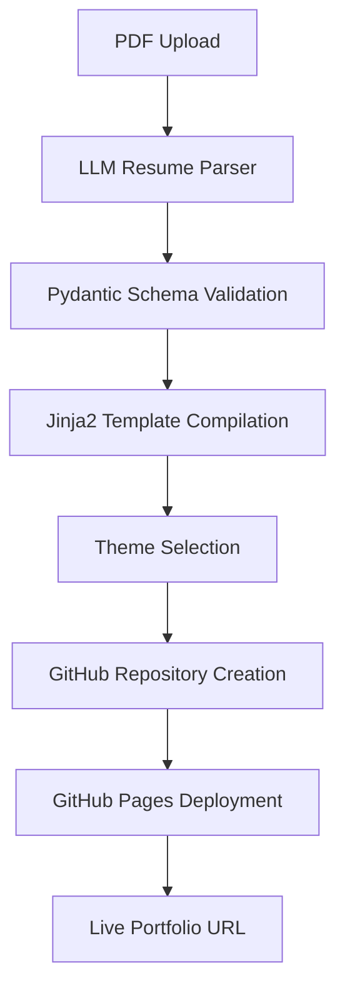
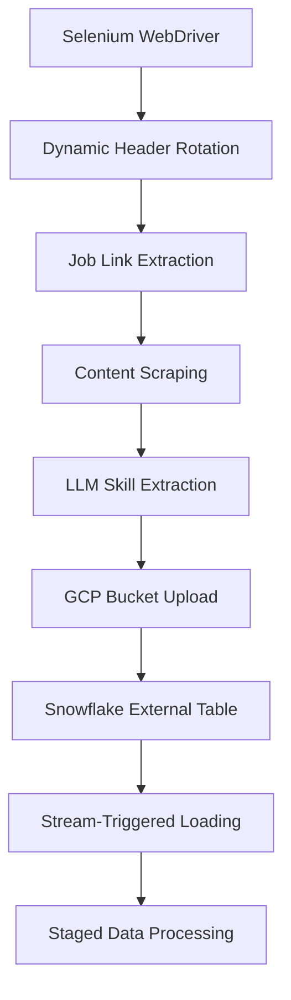
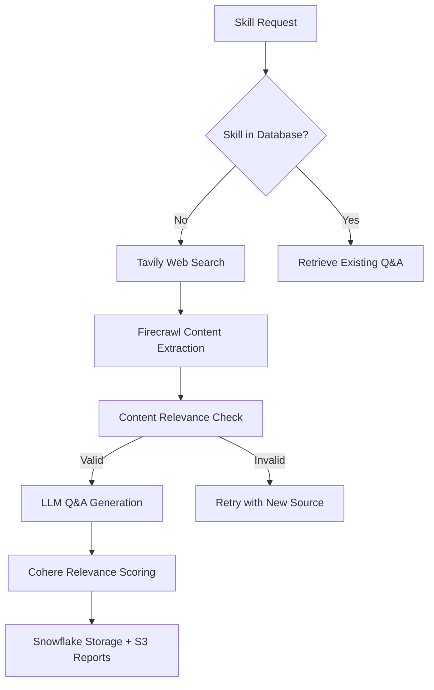

# BotFolio — AI-Powered Career Platform

BotFolio is a comprehensive **career development platform** that combines AI-powered portfolio generation, LinkedIn job scraping & processing, and automated interview preparation through Q&A generation. This end-to-end solution helps users build professional portfolios, discover relevant opportunities, and prepare for interviews using intelligent automation.

## 🚀 Key Capabilities

### Portfolio Creation Workflow
- **AI-Powered Resume Parsing**: LLM-driven extraction and structuring of semi-structured resume data
- **Dynamic Template Compilation**: Jinja2-based HTML template system with 4 unique themes
- **Real-Time Editing Interface**: Chat-based portfolio modification with instant deployment
- **GitHub Pages Integration**: Automated repository creation and hosting in seconds

### LinkedIn Job Intelligence
- **Continuous Job Scraping**: Automated pipeline processing ~2000 jobs daily (48 runs/day)
- **Anti-Detection System**: Dynamic headers and user agent rotation to bypass rate limits
- **Data Normalization**: Unstructured job descriptions converted to structured skill data
- **Cloud-Native Storage**: GCP buckets → Snowflake external tables → automated staging pipelines

### Interview Preparation Engine
- **Agentic Q&A Generation**: LangGraph-powered agents for skill-based question creation
- **Content Quality Validation**: Cohere Rerank API ensures relevance scoring between context and outputs
- **Intelligent Web Scraping**: Tavily + Firecrawl for comprehensive content discovery
- **Automated Reporting**: Markdown reports and Snowflake storage for full traceability

## 🏗️ Architecture Overview

```
┌─────────────────┐    ┌─────────────────┐    ┌─────────────────┐
│   Streamlit UI  │    │   FastAPI APIs  │    │  Airflow DAGs   │
│                 │    │                 │    │                 │
│ • Portfolio Mgmt│◄──►│ • Resume Parser │◄──►│ • Job Scraper   │
│ • Job Discovery │    │ • Theme Engine  │    │ • QA Generator  │
│ • Interview Prep│    │ • GitHub Deploy │    │ • Data Pipeline │
└─────────────────┘    └─────────────────┘    └─────────────────┘
         │                       │                       │
         ▼                       ▼                       ▼
┌─────────────────────────────────────────────────────────────────┐
│                    Data & Storage Layer                         │
├─────────────────┬─────────────────┬─────────────────┬─────────────────┤
│   Snowflake     │   Google Cloud  │      AWS S3     │     GitHub      │
│                 │                 │                 │                 │
│ • User Data     │ • Job Storage   │ • Documents     │ • Repositories  │
│ • QA Content    │ • File Uploads  │ • Reports       │ • GitHub Pages  │
│ • Pipeline Logs │ • Resume Assets │ • Validations   │ • CI/CD Deploy  │
└─────────────────┴─────────────────┴─────────────────┴─────────────────┘
```

## 📁 Project Structure

```
bigdata-org-botfolio/
├── airflow/                    # Workflow orchestration
│   ├── docker-compose.yaml    # Airflow deployment config
│   ├── Dockerfile             # Custom Airflow image with Chrome
│   └── dags/                  # Pipeline definitions
│       ├── dag_jobs_data_scrapper.py    # LinkedIn job scraping
│       ├── orchestrate_qa_pipeline.py   # Q&A workflow coordinator
│       ├── qa_datagen_pipeline.py       # Interview content generation
│       └── utils/                       # Shared utilities
│           ├── job_scrapper/            # LinkedIn scraping logic
│           ├── langgraph/              # Agent-based Q&A pipeline
│           ├── snowflake/              # Data warehouse operations
│           ├── firecrawl/              # Web content extraction
│           ├── haystack/               # RAG components
│           ├── llm/                    # Google Vertex AI integration
│           └── tavily/                 # Web search API
├── backend/                   # FastAPI application
│   ├── app.py                # Main API server
│   ├── Dockerfile           # Container configuration
│   └── utils/               # Business logic modules
│       ├── resume_parser/   # AI-powered resume processing
│       ├── theme_compilation/ # Portfolio template engine
│       ├── gcp/            # Google Cloud integrations
│       ├── snowflake/      # Data warehouse connectivity
│       └── suggested_jobs/ # Job recommendation engine
├── frontend/               # Streamlit interface
│   ├── jobs_page.py       # Job discovery & filtering
│   ├── qa.py             # Interview preparation
│   └── static/           # UI components and helpers
└── mcp/                  # Model Context Protocol (experimental)
    ├── client.py         # MCP client implementation
    └── server.py         # MCP server implementation
```

## 🎯 Core Workflows

### 1. Portfolio Generation Pipeline


**Key Features:**
- **Schema Enforcement**: Pydantic-based validation for resume sections (skills, experience, education, projects)
- **Repository Validation**: Organization-wide checks to prevent name collisions
- **Real-Time Updates**: Chat interface enables live portfolio modifications
- **Multi-Theme Support**: 4 professional themes with responsive design

### 2. LinkedIn Job Processing System


**Technical Implementation:**
- **Anti-Bot Detection**: Rotating user agents, dynamic headers, proxy support
- **Skill Normalization**: Google Vertex AI extracts technical skills from job descriptions
- **Stream Processing**: Real-time data pipeline with 30-minute refresh cycles
- **Data Quality**: Validation and deduplication at multiple pipeline stages

### 3. Intelligent Q&A Generation


**Advanced Features:**
- **Agentic Architecture**: LangGraph agents handle complex decision making
- **Quality Assurance**: Multi-stage validation with relevance scoring
- **Retry Logic**: Intelligent fallback when content quality is insufficient
- **Comprehensive Logging**: Full pipeline traceability with Markdown reports

## ⚙️ Prerequisites

- **Python 3.10+**
- **Docker & Docker Compose**
- **Google Cloud Platform** account with Vertex AI access
- **Snowflake** data warehouse
- **AWS S3** bucket for document storage
- **GitHub** account with API token
- **Airflow** orchestration platform

## 🔐 Environment Configuration

### Backend (.env)
```env
# Google Cloud Platform
GOOGLE_CLOUD_PROJECT=your-project-id
GCP_RESUME_BUCKET_NAME=your-gcs-bucket

# Snowflake Data Warehouse
SF_USER=your_snowflake_user
SF_PASSWORD=your_snowflake_password
SF_ACCOUNT=your_account_identifier
SF_WAREHOUSE=BOTFOLIO_WH
SF_DB=BOTFOLIO_DB
SF_ROLE=BOTFOLIO

# LLM Services
GEMINI_API_KEY=your_gemini_key
MISTRAL_API_KEY=your_mistral_key

# External Services
FIRECRAWL_API_KEY=your_firecrawl_key
TAVILY_API_KEY=your_tavily_key
COHERE_API_KEY=your_cohere_key

# GitHub Integration
GITHUB_TOKEN=your_github_token
GITHUB_USERNAME=your_github_username

# AWS Storage
AWS_ACCESS_KEY_ID=your_aws_key
AWS_SECRET_ACCESS_KEY=your_aws_secret
AWS_REGION=us-east-1
BUCKET_NAME=haystack-docs
```

### Airflow Configuration
```env
# Airflow Orchestration
AIRFLOW_BASE_URL=http://34.59.146.190:8081/api/v1
AIRFLOW_USERNAME=airflow
AIRFLOW_PASSWORD=airflow

# Database Connections
_AIRFLOW_WWW_USER_USERNAME=airflow
_AIRFLOW_WWW_USER_PASSWORD=airflow
```

## 🚦 Quick Start

### Option 1: Local Development

**1. Backend Setup**
```bash
cd backend
python -m venv .venv
source .venv/bin/activate  # Windows: .venv\Scripts\activate
pip install -r requirements.txt
uvicorn app:app --host 0.0.0.0 --port 8000 --reload
```

**2. Frontend Launch**
```bash
cd frontend
pip install -r requirements.txt
streamlit run jobs_page.py --server.port=8501
```

**3. Airflow Pipeline** (Optional - for job scraping & Q&A)
```bash
cd airflow
docker-compose up -d
# Access Airflow UI: http://localhost:8081
```

### Option 2: Full Docker Deployment

**1. Build and Deploy Backend**
```bash
cd backend
docker build -t botfolio-backend .
docker run -p 8000:8000 --env-file .env botfolio-backend
```

**2. Launch Airflow with Dependencies**
```bash
cd airflow
docker-compose up -d
```

**3. Access Services**
- **Streamlit UI**: https://botfolio2.streamlit.app/
- **API Documentation**: https://botfolio-apis-548112246073.us-central1.run.app/docs
- **Airflow Dashboard**: http://34.59.146.190:8081/home

## 🔌 API Reference

### Core Endpoints

| Method | Endpoint | Description | Key Features |
|--------|----------|-------------|--------------|
| POST | `/upload-to-gcp` | Upload PDF resume | GCP storage with presigned URLs |
| POST | `/json-to-sf` | Parse resume to JSON | LLM-powered extraction & validation |
| POST | `/login` | User authentication | Snowflake-backed user management |
| POST | `/compile` | Generate portfolio HTML | Jinja2 templating with theme selection |
| POST | `/deploy` | Deploy to GitHub Pages | Automated repo creation & CI/CD |
| POST | `/jobs-api` | Job discovery & filtering | Real-time data with advanced filters |
| POST | `/trigger_dag` | Start interview prep | Airflow DAG orchestration |
| GET | `/pipeline_status` | Monitor Q&A generation | Real-time pipeline tracking |
| POST | `/qa-validation` | Submit interview answers | AI-powered feedback generation |

### Example Usage

**Portfolio Deployment**
```bash
curl -X POST "https://botfolio-apis.../deploy" \
  -H "Content-Type: application/json" \
  -d '{
    "user_email": "developer@example.com",
    "theme": "Theme 1",
    "repo_name": "my-portfolio"
  }'
```

**Job Discovery with Filters**
```bash
curl -X POST "https://botfolio-apis.../jobs-api" \
  -H "Content-Type: application/json" \
  -d '{
    "filter": {
      "role": "data engineer",
      "time_filter": "2hr",
      "seniority_level": "Mid Level",
      "employment_type": "Full-time"
    }
  }'
```

**Interview Preparation**
```bash
curl -X POST "https://botfolio-apis.../trigger_dag" \
  -H "Content-Type: application/json" \
  -d '{
    "skills": ["Python", "Machine Learning", "AWS"],
    "job_url": "https://linkedin.com/jobs/view/...",
    "user_email": "candidate@example.com"
  }'
```

## 🎨 Portfolio Themes

### Theme 1 - Modern Professional
- **Design**: Dark blue with teal accents
- **Layout**: Card-based with smooth animations
- **Best For**: Software engineers, technical professionals

### Theme 2 - Creative Gradient
- **Design**: Vibrant purple/pink gradients
- **Layout**: Timeline-based experience section
- **Best For**: Designers, creative professionals

### Theme 3 - Clean Minimal
- **Design**: Light theme with teal/amber accents
- **Layout**: Minimal, elegant professional style
- **Best For**: Business professionals, consultants

### Theme 4 - Bold Interactive
- **Design**: Slate blue with red accents
- **Layout**: Interactive elements with modern visuals
- **Best For**: Product managers, marketing professionals

## 📊 Data Pipeline Details

### Snowflake Schema Architecture
```sql
-- Core Tables
CREATE TABLE USER_ARTIFACTS (
    USER_EMAIL VARCHAR PRIMARY KEY,
    RESUME_PDF_URL VARCHAR,
    RESUME_JSON VARIANT,
    UI_ENDPOINT VARCHAR,
    THEME VARCHAR,
    CREATED_AT TIMESTAMP DEFAULT CURRENT_TIMESTAMP
);

CREATE TABLE JOB_HISTORY (
    ID VARCHAR PRIMARY KEY,
    POSTED_DATE TIMESTAMP,
    JOB_ROLE VARCHAR,
    TITLE VARCHAR,
    COMPANY VARCHAR,
    SKILLS ARRAY,
    URL VARCHAR,
    LOCATION VARCHAR,
    PROCESSED_AT TIMESTAMP DEFAULT CURRENT_TIMESTAMP
);

CREATE TABLE SKILL_QA (
    ID NUMBER AUTOINCREMENT PRIMARY KEY,
    SKILL VARCHAR,
    QUESTION TEXT,
    ANSWER TEXT,
    SOURCE VARCHAR,
    CREATED_AT TIMESTAMP DEFAULT CURRENT_TIMESTAMP
);

CREATE TABLE QA_PIPELINE_STATUS (
    DAG_RUN_ID VARCHAR PRIMARY KEY,
    USER_EMAIL VARCHAR,
    SKILLS ARRAY,
    STATUS VARCHAR,
    QA_DATA VARIANT,
    STARTED_AT TIMESTAMP,
    ENDED_AT TIMESTAMP
);
```

### Stream Processing Pipeline
```sql
-- External Table pointing to GCP
CREATE OR REPLACE EXTERNAL TABLE gcs_ext_table (
    job_data VARIANT
) LOCATION=@gcs_stage
FILE_FORMAT = (TYPE = 'JSON');

-- Stream for real-time processing
CREATE STREAM stg_job_stream ON TABLE stg_job_history;

-- Automated task for data ingestion
CREATE TASK stg_load_jobs_task
WAREHOUSE = BOTFOLIO_WH
SCHEDULE = 'USING CRON 0,30 * * * * UTC'  -- Every 30 minutes
WHEN SYSTEM$STREAM_HAS_DATA('stg_job_stream')
AS
INSERT INTO stg_job_history 
SELECT * FROM gcs_ext_table;
```

## 🏭 Production Architecture

### Performance Optimizations
- **Caching Strategy**: Redis for frequently accessed job data (30-minute TTL)
- **Batch Processing**: 2000+ jobs processed daily with parallel execution
- **Database Optimization**: Incremental loading with change data capture
- **API Rate Limiting**: Intelligent backoff and retry mechanisms

### Monitoring & Observability
- **Pipeline Health**: Airflow monitoring with SLA alerting
- **Data Quality**: Automated validation checks at each pipeline stage
- **Performance Metrics**: Response time tracking and success rate monitoring
- **Cost Analytics**: LLM usage tracking and optimization recommendations

### Security & Compliance
- **Data Encryption**: All sensitive data encrypted at rest and in transit
- **Access Control**: Role-based permissions with audit logging
- **API Security**: Rate limiting and input validation on all endpoints
- **Credential Management**: Environment-based configuration with secret rotation

## 🧪 Advanced Features

### Agentic Q&A Generation
The system uses LangGraph to create intelligent agents that:
- **Research Skills**: Automatically discover relevant learning resources
- **Content Validation**: Ensure generated questions meet quality standards
- **Retry Logic**: Handle failed attempts with alternative approaches
- **Quality Scoring**: Use Cohere Rerank API for relevance validation

### Dynamic Job Matching
Advanced algorithms for job recommendation:
- **Skill Matching**: Semantic similarity between user skills and job requirements
- **Experience Weighting**: Consider seniority level and career progression
- **Location Intelligence**: Geographic preference optimization
- **Company Culture Fit**: Analyze company descriptions for culture matching

## 🔧 Troubleshooting

### Common Issues

**Airflow DAG Not Triggering**
```bash
# Check Airflow scheduler status
docker-compose exec airflow-scheduler airflow jobs check --job-type SchedulerJob

# Manually trigger DAG
airflow dags trigger orchestrate_qa_pipeline --conf '{"user_email":"test@example.com"}'
```

**Snowflake Connection Failures**
```bash
# Verify credentials and network connectivity
python -c "
import snowflake.connector
conn = snowflake.connector.connect(
    user='${SF_USER}',
    password='${SF_PASSWORD}',
    account='${SF_ACCOUNT}'
)
print('Connection successful!')
"
```

**GitHub Deployment Issues**
```bash
# Check GitHub API token permissions
curl -H "Authorization: token ${GITHUB_TOKEN}" \
     https://api.github.com/user

# Verify repository creation permissions
curl -H "Authorization: token ${GITHUB_TOKEN}" \
     -X POST https://api.github.com/user/repos \
     -d '{"name":"test-repo","private":false}'
```

**LLM API Rate Limits**
- **Gemini**: 60 requests/minute, implement exponential backoff
- **Mistral**: Handle 429 status codes with retry delays
- **Cohere**: Monitor usage quotas and implement circuit breakers

## 🎯 Use Cases & Success Stories

### Enterprise Portfolio Management
- **HR Departments**: Streamline employee portfolio creation for internal mobility
- **Consulting Firms**: Generate client-facing consultant profiles at scale
- **Universities**: Help career centers assist students with professional portfolios

### Recruitment Intelligence
- **Talent Acquisition**: Real-time job market analysis and competitive intelligence
- **Staffing Agencies**: Automated candidate-job matching with skills analysis
- **Career Coaches**: Data-driven insights for client career planning

### Interview Preparation
- **Bootcamps**: Automated interview prep content for specific skill tracks
- **Corporate Training**: Role-specific interview preparation for internal candidates
- **Job Seekers**: Personalized question banks based on actual job requirements

---

**Built for the Future of Career Development** 🚀

*BotFolio represents the next generation of career development tools, combining the power of AI, modern cloud architecture, and intelligent automation to create a comprehensive platform that grows with your career.*
