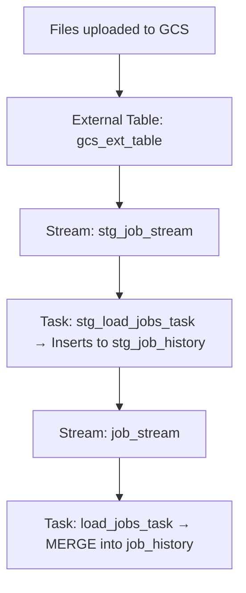
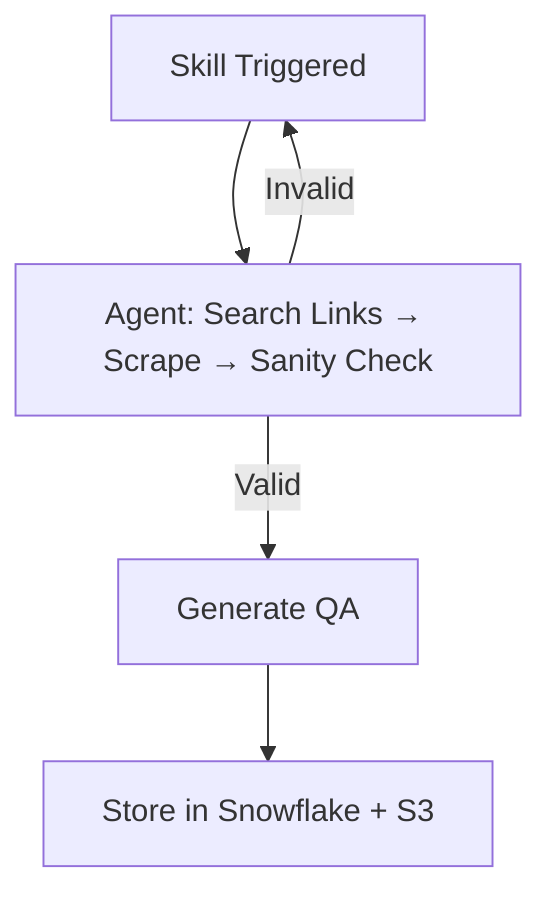

# BotFolio

1. **UI: https://botfolio2.streamlit.app/**
2. **API URL : https://botfolio-apis-548112246073.us-central1.run.app/docs**
3. **Airflow : http://34.59.146.190:8081/home**
4. **Codelabs: https://codelabs-preview.appspot.com/?file_id=1jo5-Wh5N6aHJ7m8jxf7PrH7h3HG9GhcThXo8-U-iglg#4**

# 🚀 Project Overview


 
This project spans three key verticals:
 
1. **User Portfolio Generation**
2. **LinkedIn Job Scraping & Processing**
3. **Automated Interview Q&A Generation**
 
---
 
## 📄 1. Portfolio Creation Workflow
 
A highly interactive, fast, and automated portfolio-building pipeline powered by LLMs.
 
### 🔧 Workflow:
 
- **Resume Parsing & Template Compilation**:
 
  - Semi-structured data (user resumes) is parsed using LLMs.
  - A **Jinja2-based HTML** template is dynamically compiled to generate a visually appealing portfolio.
 
- **Theme Selection**:
 
  - Users can choose from **4 unique themes** to personalize the look and feel of their portfolios.
 
- **Real-Time Editing & Deployment**:
 
  - A chat interface enables users to revise sections of their portfolio.
  - Changes reflect in real time.
  - With a single command, portfolios can be **re-deployed in seconds**.
 
 
### ✅ Validations:
 
- **Pydantic-Based Schema Validations**:
 
  - Every resume section (skills, experience, education, projects) undergoes **strict schema validation**.
 
- **Repo Validation**:
 
  - To avoid duplication and resource collisions, repositories are checked against organization-wide existence.
 
- **Test Suite**:
 
  - `pytest` is used to validate if **LLM responses** satisfy user requests and intent.
 
---
 
## 💼 2. LinkedIn Job Scraping & Data Processing
 
A scheduled pipeline to continuously gather and preprocess job postings from LinkedIn.
 
### 🔄 Workflow:
 
- **Dynamic Headers**:
 
  - Rotating user agents and headers to **bypass rate limits and bot detection**.
 
- **Unstructured to Structured Data Conversion**:
 
  - Skills are extracted from job descriptions and normalized for **downstream QA generation**.
 
- **Cloud Storage + Snowflake Integration**:
 
  - Job data is stored in **GCP buckets**.
  - A Snowflake **external stage** is pointed at this bucket.
  - External tables refresh every 30 minutes, followed by incremental **staging pipelines**.
 
- **Frequency**:
 
  - Pipeline runs **48 times/day** (~every 30 mins).
  - Processes **~2000 jobs/day**.
 
### 🧪 Stream + Task Pipeline
 

 
### ⚙️ Bootstrap Strategy After Schema Recreation
 
If schema is recreated and no data appears:
 
1. Manually insert data from `gcs_ext_table` into `stg_job_history`:
 
```sql
INSERT INTO stg_job_history (...) SELECT ... FROM gcs_ext_table;
```
 
2. Call the downstream load procedure:
 
```sql
CALL load_jobs();
```
 
3. Going forward, new GCS uploads will trigger the refresh → stream → load chain.
 
---
 
## 📚 3. Interview Q&A Generation Pipeline
 
This component powers skill-based Q&A generation using an **agentic architecture** integrated into **Airflow**.
 
### 🧠 Workflow:
 
1. **Skill Detection**:
 
   - If a requested skill doesn't exist in the database, a new Airflow DAG is triggered.
 
2. **Agentic Flow**:
 
   - The agent:
     - Looks for relevant links.
     - Scrapes them.
     - Runs sanity checks.
     - If valid → generates QA.
     - If not → **loops back to the first task** to retry (up to 2 times).
 
3. **Sanity & Validation**:
 
   - Utilizes **Cohere Rerank API** to ensure the **relevance score** between raw context and LLM outputs.
 
4. **Storage**:
 
   - Validated Q&A content is stored in Snowflake.
   - Markdown reports are saved to **S3** for traceability.
 
### 🧠 Agent Flow
 

 
---
 
## 🧩 Challenges
 
- **Rate Limits and Bot Detection**: For job scraping and scraping links for QA generation, dynamic headers and proxy rotation are essential.
- **LLM Consistency**: Ensuring reliable and accurate LLM output that satisfies user intent.
- **Schema Enforcement**: Maintaining strict schema validation to ensure high data quality.
- **Real-Time Feedback Loops**: Integrating user feedback on portfolios and Q&A in a live interface poses concurrency and caching challenges.
- **Stream Bootstrapping**: Recreating schemas resets stream tracking; manual bootstrapping is needed for initial loads.
 
---
 
## ✅ Future Improvements
 
- Add Redis for rate limit tracking
- Add Kafka for decoupled skill ingestion flow
- Frontend dashboard to visualize pipeline success/failures
 
---
 
This project brings together automation, intelligence, and a user-first experience across career-building workflows.
